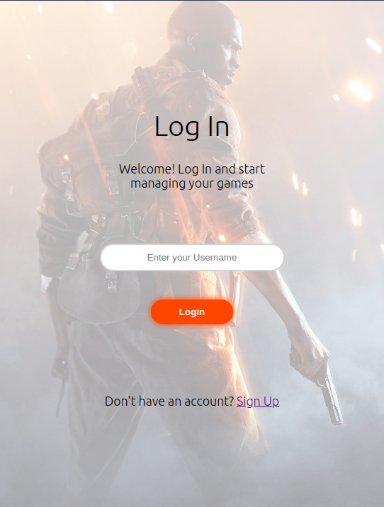
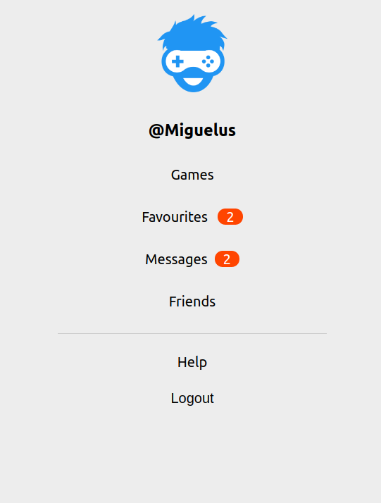
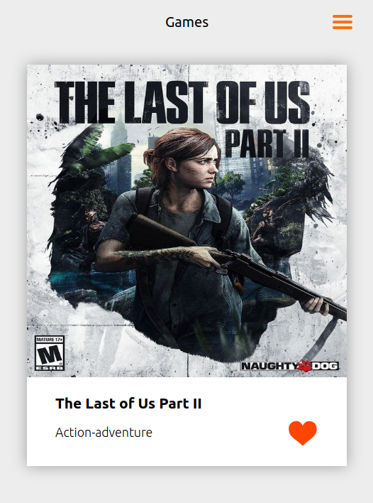
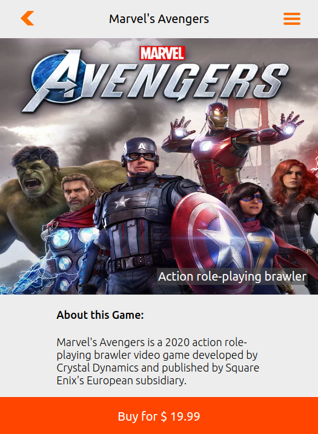

# Game-Finder

> Game Finder is a Full Stack mobile app in which you can create an account, search through a list of games and add those you like to your Favourite games list. In both of these lists you can check out more details about these games by clicking on them.

 
> You first need to sigin or login and then you'll have acces to the full list of games as well as your own list favourites games.

 
> In the list of games there is a heart that indicates if the game is in your favourites list. If you click on any game you will be redirected to the details page of that game.

---

## Built With

- Javascript ES6
- React
- Redux
- [GameFinderApi](https://github.com/Miguelus373/Game-Finder-API)
- HTML
- CSS
- VS Code

## Live Demo

> Check this app online on its [Live demo](https://gamefinderapp.herokuapp.com/)

## Installation

> You could have a local copy of this project by following these simple steps:

- Install Node in your system. To install Node, you can read the [Documentation](https://nodejs.org/en/download/package-manager/)
- Clone the repo or download the zip file into your machine. 
    ``` 
   git clone https://github.com/Miguelus373/Rick-and-Morty-Catalog.git
    ``` 
- On your terminal, CD into the Rick-and-Morty-Catalog folder and run
    ``` 
   npm install
    ``` 
- This will install all the dependancies.

- Then run 
    ``` 
   npm start
    ``` 
- This will start a local server that you can access with [This Link](http://localhost:8000/) on your browser

## Testings

> This project has unit tests for most of the logic. Follow these steps to run them:

- First you will need a local copy of this project (folow the [Installation](##installation) section).

- Once you have this project up and runnig, CD into the Game-Finder folder and run
    ``` 
   npm run test
    ``` 
- This will run all tests and show you the results

---


## Author  

👤 **Miguel Uzcátegui**

- Github: [@miguelus373](https://github.com/miguelus373)
- Linkedin: [Miguel-Uzcátegui](https://www.linkedin.com/in/miguelus/)


## 🤝 Contributing

Contributions, issues and feature requests are welcome!. Feel free to check the [issues page](https://github.com/Miguelus373/Game-Finder/issues).

## Show your support

Give a ⭐️ if you like this project!

## Acknowledgments

- This is the Final Capstone project for Microverse

- This is the Frontend of the Game Finder App, you can find the Backend [here](https://github.com/Miguelus373/Game-Finder-API)

- Design idea by [Alexey Savitskiy on Behance](https://www.behance.net/alexey_savitskiy)

## 📝 License
This project is [MIT](https://github.com/Miguelus373/Game-Finder/blob/develop/LICENSE) licensed.